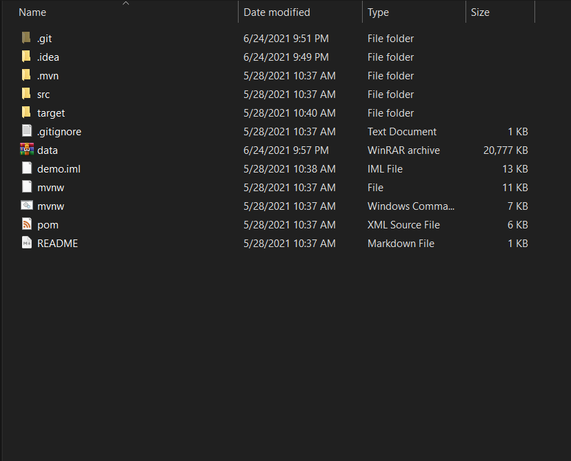
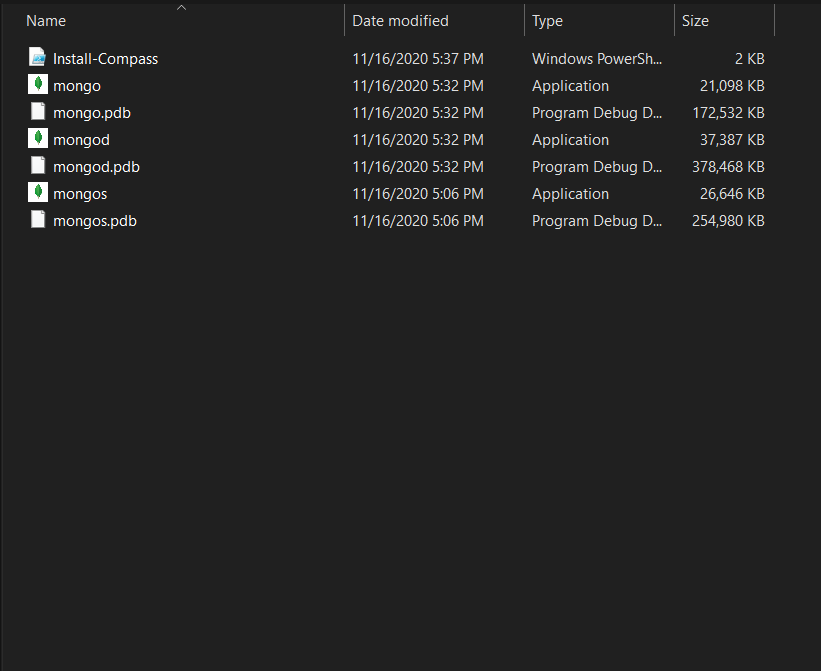
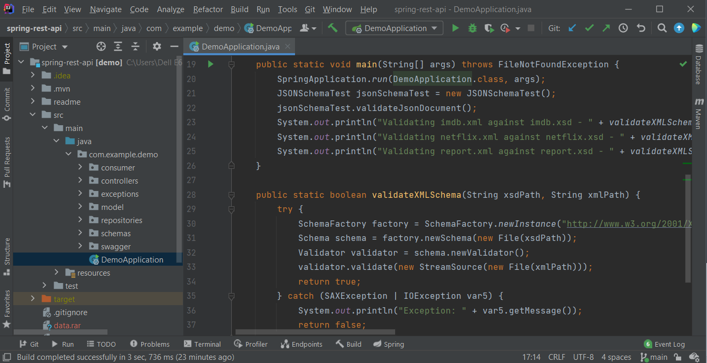
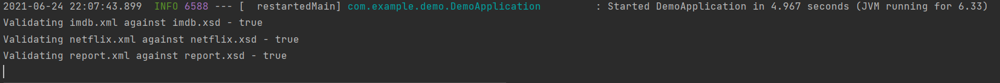
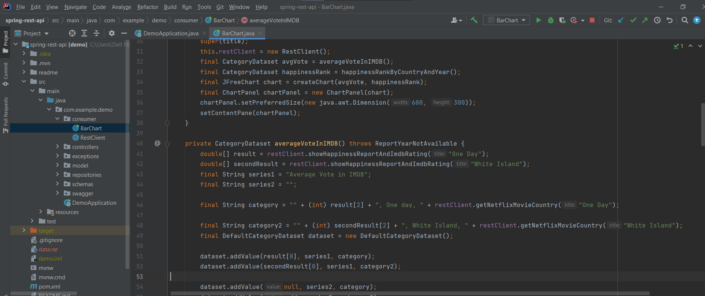
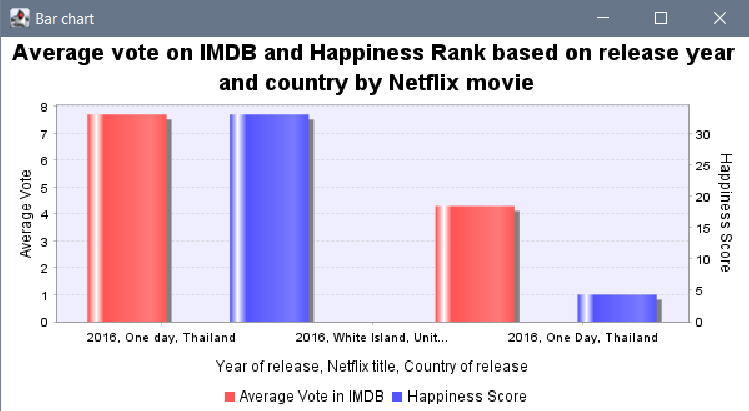

# REST API

This readme file will explain how to run this project and get you going for further development.
Swagger documentation can be found at https://localhost:8080/swagger-ui.html

You need:

- MongoDB used for dataset storage - https://www.mongodb.com/try/download/community
- Any IDE(preferably IntelliJ IDEA) - https://www.jetbrains.com/idea/download/

1. In the folder you will find a .rar file named data. This is your database containing all the necessary datasets for the project to run. Extract that folder in your (:C) directory.

2. Find your MongoDB installation directory and run mongod.exe

3. Load the project in a IDE of your choice. Navigate to src/main/java/DemoApplication and run it.

   

   Upon a successful run you should see this on the console

   

4. Navigate to src/main/java/consumer and run BarChart for visualization **while not stopping the DemoApplication!**

   

   Upon a successful run you should see a bar chart showing information from our database.

   
